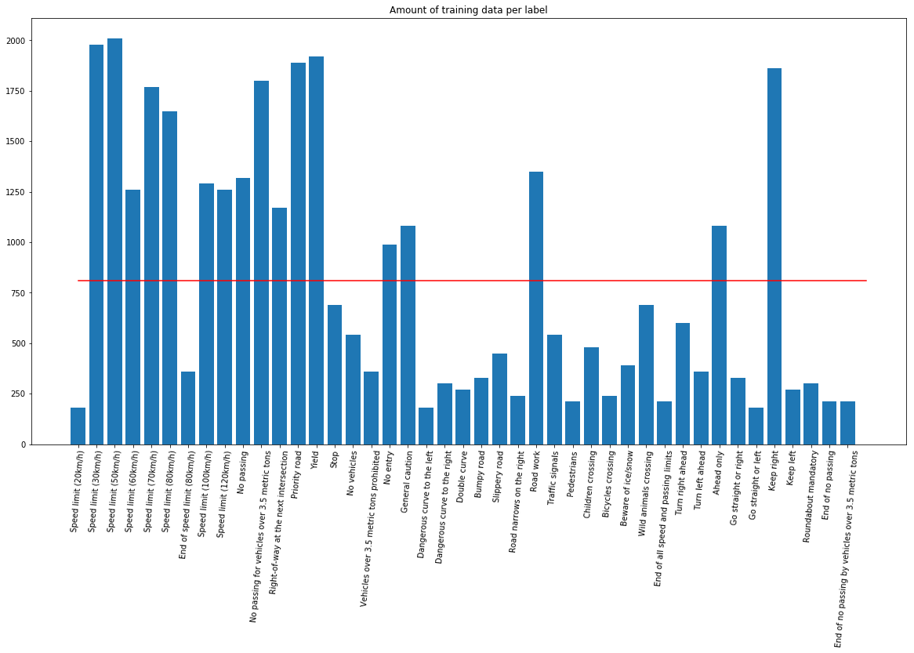
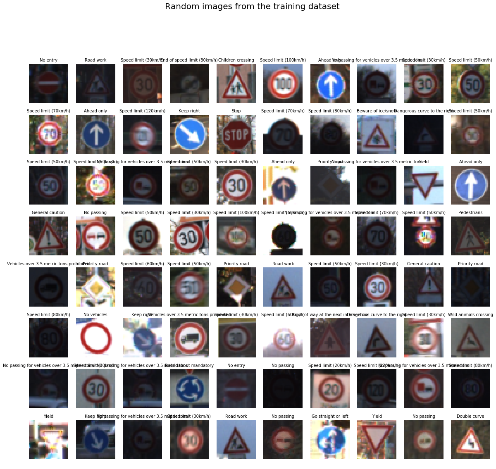
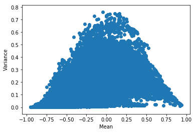
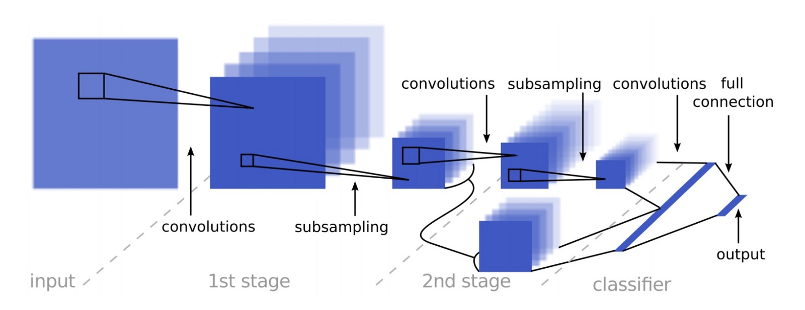
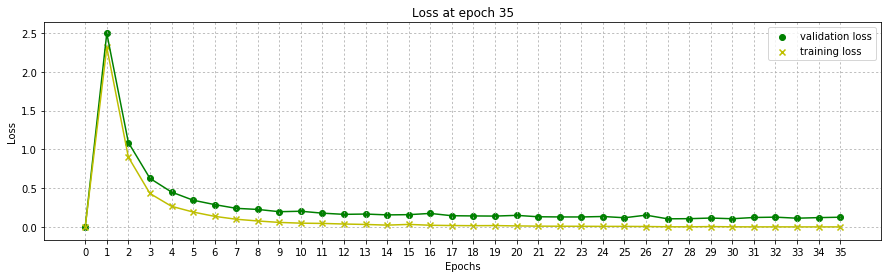
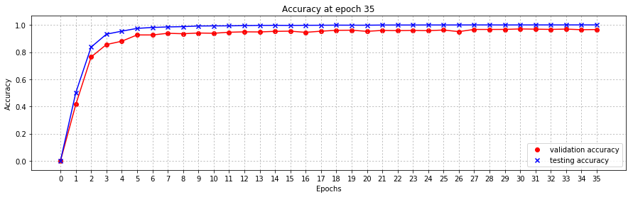
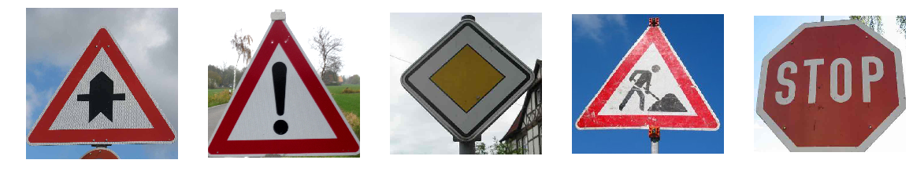
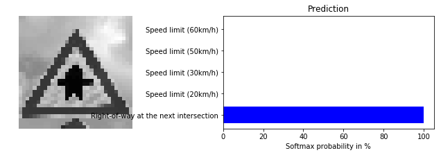
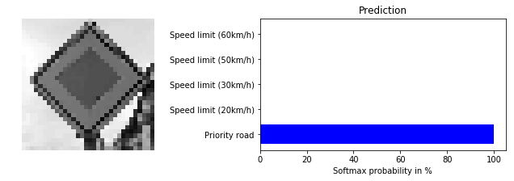
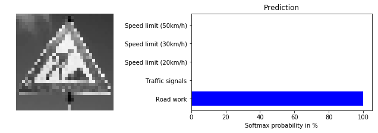

#**Traffic Sign Classifier CNN** 
---

**Build a Traffic Sign Recognition Convolutional Neural Network**

The goals / steps of this project are the following:

- Load the data set (see below for links to the project data set)
- Explore, summarize and visualize the data set
- Design, train and test a model architecture
- Use the model to make predictions on new images
- Analyze the softmax probabilities of the new images
- Summarize the results with a written report

###Data Set Summary & Exploration

####1. Dataset summary

The dataset used comes from the [_GTSRB_](http://benchmark.ini.rub.de/?section=gtsrb&subsection=dataset) (German Traffic Sign Recognition Benchmark). It contains __51839__ __32x32x3__ images split amongst __43__ different classes of German traffic signs. The dataset is split as follows:

- 34799 training examples (67.13%)
- 12630 testing examples (24.36%)
- 4410 validation examples (8.51%)

The dataset is split unevenly amongst its classes, the lowest frequency of training examples is __180__ images and the highest is __2010__ images. The average frequency over all the classes is __809__ training examples per class.

####2. Exploratory visualization of the dataset.

The following bar chart shows the frequency of training examples over all the dataset's classes:

A set of 80 randomly selected images from the training dataset gives us an idea of what we are dealing with:

 

As we can see, the images are of varying brightness, orientation, size and clarity.

###The Model Architecture

The following model architecture is based off of Pierre Sermanet and Yann LeCun's [paper on the issue](http://yann.lecun.com/exdb/publis/pdf/sermanet-ijcnn-11.pdf).

####1. Data preprocessing

##### Grayscale
In their introduction, they briefly mention that they were able to reach 99.2% accuracy using grayscale images. The advantage of grayscale images is that they have a lower dimensionality (3 vs 1) to start with allowing for a lower amount of trainable parameters. This not only allows our neural network to train faster but also allows us to lower our learning rate for better convergence at a lower time cost.

##### Data normalization
All the images in the dataset are normalized to have 0 mean and equal variance. In order to verify the process, we can plot the mean and variance of each image:

As we can see, the mean of the dataset is at zero and its distribution spreads between -1 and 1.

##### Data augmentation
One last optional step was the augmentation of the dataset, I tried implementing it by reusing Keras' _ImageDataGenerator_ in order to build a real time image augmentation pipeline, the idea worked but failed during training due to memory errors. I finally decided against data augmentation in the favour of time. If the research paper is to be believed, this should not have a major effect on our model's accuracy. 

####2. Model Architecture

My model is based on the Sermanet LeCun paper's model:

It consists of the following layers

| 		Layer         	|     		Description	        			| 
|:---------------------:|:---------------------------------------------:| 
| Input         		| 32x32x1 Grayscale & normalized image   		| 
| Convolution 5x5     	| 1x1 stride, valid padding, outputs 28x28x20 	|
| RELU					|
| Dropout				| Dropout layer to decrease overfitting			|									
| Max pooling	      	| 2x2 stride,  outputs 14x14x20					|
| Flattening	      	| Flattens the layer for later use, outputs 1x3920|
| Convolution 5x5	    | on the previous max pool layer, 1x1 stride, valid padding, outputs 10x10x40 |
| RELU					|
| Max pooling	      	| 2x2 stride,  outputs 5x5x40					|
| Flattening	      	| Flattens the 5x5x40 layer, outputs 1x1000		|
| Concatenation	      	| Concatenates the two flat layers, outputs 1x4920	|
| Dropout				| Dropout layer to decrease overfitting			|
| Fully connected		| 500 neurons fully connected layer   			|
| RELU					|
| Dropout				| Dropout layer to decrease overfitting			|								
| Fully connected		| 200 neurons fully connected layer				|
| RELU					|
| Dropout				| Dropout layer to decrease overfitting			|
| Fully connected		| Output layer, size is equal to the number of classes to predict |
 
####3. Model Training
A graph of the training and validation loss over all the training epochs, as we can see, there are signs of mild overfitting:

_NOTE: Loss does not start at 0, that is a code reuse error_
##### Epochs
To train the model, I used a total of 35 epochs. This value was found through experimentation. As we can see, the loss slightly increases towards the end showing early signs of overtraining.

##### Batch size
I use a batch size of 256 images and reshuffle the data at every epoch. The batch size did not prove to change much in the training accuracy.

##### Training rate
Through experimentation I found the training rate to be crucial in achieving good results, a higher training rate made the neural net's trainable parameters skip over their optimal values leading to spikes and drops in the validation loss. A decaying training rate would be ideal but the amount of trial and error needed to find the optimal value and function proved more difficult than I previously thought.

##### Dropout rate
The use of dropout layers greatly aided in overfitting prevention, I tried turning off dropout completely after a certain number of epochs but the neural net would overfit to the training data very fast. I decided to only lower the dropout rate after around 25 training epochs.

##### L2 regularization
The use of L2 regularization did not make an observable difference over the course of training, it did however dramatically increase the required training time. The lack of overfitting prevention may be due to a non-optimal beta value but the training time stood as an obstacle when trying to find its optimal value. This technique should be revisited once I get TensorFlow working on my GPU.

####4. Approach to finding the right architecture
My final model results were:

- training set accuracy of __100%__
- validation set accuracy of __96.6%__
- test set accuracy of __95%__

##### The chosen architecture
After a lot of trial and error I decided to base my architecture on Sermanet and LeCun's paper. Reusing my LeNet implementation and adding a side layer which feeds high level feature filters directly to the fully connected layer, this technique showed a direct increase in accuracy.

##### Architecture's relevancy
Feeding the image's higher level features directly to the fully connected layer forces the classifier to look at higher level features such as the general shape and borders. Traffic signs use high level features such as shape and colour to help humans easily and quickly recognize them, it is a quintessential part of their designs. This makes the high level feature focus based architecture extremely relevant to the task at hand.

##### Accuracy
A 100% training accuracy shows that the neural net can recall all the images it has already been fed, this is only good if our validation accuracy is not too far behind. During training the difference between the training and validation accuracy hovered around 4% meaning that the classifier is in fact learning about patterns in traffic signs and is not fitting to an abstract pattern in our training data. The testing accuracy is just behind our final validation accuracy by 1% proving that our classifier is able to classify traffic signs.

###Testing on New Images

####1. Five German traffic signs from the internet 

Here are five German traffic signs that I found on the web:

All the images show clear traffic signs with varying backgrounds, brightness and orientation.

####2. Prediction

Here are the results of the prediction:

| Image			        |     Prediction	        					| 
|:---------------------:|:---------------------------------------------:| 
| Right of way at next intersection	| Right of way at next intersection | 
| General caution     	| General caution 								|
| Priority road			| Priority road									|
| Road work	      		| Road work						 				|
| Stop					| Yield			      							|

The model was able to correctly guess 4 of the 5 traffic signs, which gives an accuracy of 80%. This compares favourably to the accuracy on the test set. The only wrong prediction of a stop sign being a yield sign shows that our self-driving car has the ability of replacing taxis in pretty much any major city in the world.

####3. Softmax Probability

Taking a look at the softmax probability of each prediction shows that our neural net is pretty certain about its outputs with all probabilities being > 95%.

### Future improvements
The current model shows an acceptable 95% accuracy. However, a lot more can be done to achieve a higher accuracy.

##### Data Preprocessing 
The use of more complex data normalization techniques such as __global and local contrast normalization__ and __PCA whitening__ can help lower false positives that rise from data normalization miss-haps. 

##### Data Augmentation
The use of data augmentation could greatly help the accuracy on classes with a low amount of training examples. 

##### Architecture
The use of a __deeper neural net architecture__ could probably help achieve a better accuracy as it would allow the neural net to build a deeper feature map which would help it classify better. This comes at the cost of more trainable parameters. The use of __inception modules__ from the original GoogLeNet could be very beneficial for this specific task

##### Training
The use of __learning rate decay__ and __L2 regularization__ with an optimal beta value can help our neural net's weights converge to their more optimal values while lowering overfitting and overtraining.

##### Testing
Having a __look at false positives__ from our testing set as well as a __per class test accuracy__ could give us more insight for future improvements

